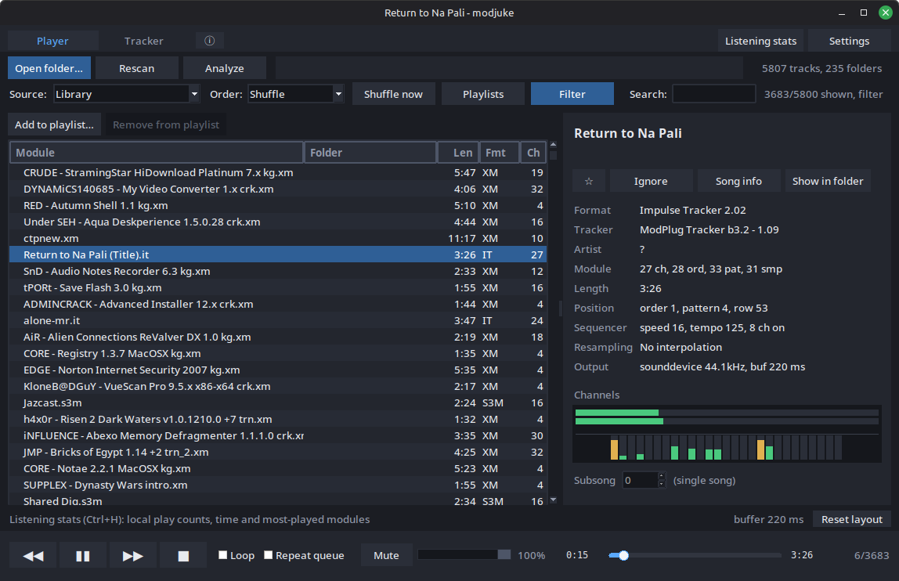

# modjuke



A desktop tracker-music player built with [**libopenmpt**](https://lib.openmpt.org/libopenmpt/) and [**Tkinter**](https://docs.python.org/3/library/tkinter.html).

## Features

- Folder scanning, search, and filters for format, duration, and playable files.
- **Automatic background analysis** for module lengths, formats, channel counts, and titles.
- Playlists with automatic saving, drag-to-reorder, and M3U import/export.
- Favorites and ignore lists.
- A tracker view with optional smooth following.
- Song information, sample/instrument names, and module comments.
- Track looping, queue repeat, and shuffle.
- Configurable audio backends, output sample rate, interpolation, buffering, and device latency.
- Five built-in themes plus custom themes with a visual colour editor.
- Optional session restoration and local listening history.

## Requirements

- Python **3.9 or newer**.
- [Tkinter](https://docs.python.org/3/library/tkinter.html) for the graphical interface.
- The **[libopenmpt](https://lib.openmpt.org/libopenmpt/) shared library**, installed separately from the Python packages.
- [NumPy](https://numpy.org/) and at least one audio backend for audible playback: [`sounddevice`](https://python-sounddevice.readthedocs.io/en/0.5.3/) or [`soundcard`](https://soundcard.readthedocs.io/en/latest/).

## Installation (Linux, per-user)

Install the external system dependencies first.

```bash
sudo apt update
sudo apt install python3-venv python3-tk libopenmpt0t64 libportaudio2 libpulse0 libasound2-plugins
```

> [!IMPORTANT]
> On older Debian/Ubuntu-based releases, use `libopenmpt0` instead of `libopenmpt0t64` if that is the available package. On other Linux distributions, install the equivalent Python/venv, Tk, libopenmpt, PortAudio and PulseAudio client packages with your package manager. A PulseAudio-compatible service is needed to use the SoundCard backend on Linux, this is commonly provided by PulseAudio or PipeWire.

Then install modjuke:

```bash
sh install.sh
```

If you're interested, the installer:

- Checks Python 3.9+, Tkinter, libopenmpt and PortAudio.
- Installs the application and its Python dependencies in a private virtual environment.
- Adds `modjuke` and `modjuke-uninstall` to `~/.local/bin`.
- Adds an application-menu entry and icon.

**No native libraries are bundled in the release ZIP or copied from the system.** Tk, libopenmpt, PortAudio and the PulseAudio client library remain external system dependencies. Python packages such as NumPy, SoundDevice and SoundCard are installed separately into the private environment.

Launch **modjuke** from the application menu, or run:

```bash
~/.local/bin/modjuke
~/.local/bin/modjuke --check
```

If `~/.local/bin` is already on your `PATH`, the short command `modjuke` works too. Otherwise add this line to your shell profile and open a new terminal:

```bash
export PATH="$HOME/.local/bin:$PATH"
```

After a successful installation, the extracted source directory can be moved or deleted.

#### Updates and removal

Close modjuke, extract a newer release, and run `sh install.sh` again. A fresh environment is prepared and checked before switching the launcher to it. A failed dependency installation leaves the previous version in place. The immediately previous release is retained, and older installer-owned releases are cleaned up on subsequent successful updates.

To uninstall, close the application and run:

```bash
~/.local/bin/modjuke-uninstall
```

You can also use `sh install.sh --uninstall` from an extracted release, with the same `XDG_DATA_HOME` used for installation. Removal keeps your configuration, cached metadata, playlists, listening history and music. Modified launcher/menu/icon files and unrelated files in the installation directory are preserved with a notice.

#### Locations and installer options

| Item | Default location |
| --- | --- |
| Application and private environments | `~/.local/share/modjuke/` |
| Terminal commands | `~/.local/bin/modjuke`, `~/.local/bin/modjuke-uninstall` |
| Menu entry | `~/.local/share/applications/modjuke.desktop` |
| Icon | `~/.local/share/icons/modjuke.png` |

> [!NOTE]
> `XDG_DATA_HOME`, if set to an absolute path, replaces `~/.local/share` for the application, menu entry and icon. It does not change the configuration directory described below. A small `.modjuke-install.lock` file in the data directory prevents concurrent installs/uninstalls.

```bash
sh install.sh --check                    # check native prerequisites only
sh install.sh --help
PYTHON=/usr/bin/python3 sh install.sh    # choose a Python interpreter
```

If you use a custom `MODJUKE_LIBOPENMPT` path during installation, a successfully loaded override is recorded in the launcher so menu launches can find it too. An explicit runtime override takes precedence.

The release layout keeps image assets separate from the Python package:

```text
img/
  modjuke.png
modjuke/
install.py
install.sh
pyproject.toml
requirements.txt
README.md
```

The installer reads the application icon from `img/modjuke.png` and installs it into the icon directory listed above. The same PNG is used for application windows and is included in pip-installed packages, no image-processing dependency is needed. Upgrades remove an old installer-owned icon only if its contents are unchanged, modified icons are preserved.

### Manual installation with pip

If you prefer managing the environment yourself, install the native dependencies, then run these commands from the directory containing `pyproject.toml`:

```bash
python3 -m venv .venv
source .venv/bin/activate
python -m pip install ".[audio]"
modjuke --check
modjuke
```

With this method, activate the environment in each new terminal. It does not create a menu entry, the per-user installer above does.

### Other platforms

Install Python with Tkinter, libopenmpt, and any native audio libraries required by your chosen backend. Then create a virtual environment and run `python -m pip install ".[audio]"` from the project directory.

- **Windows:** use `python -m venv .venv` and activate with `.venv\Scripts\Activate.ps1` in PowerShell. Install a libopenmpt DLL matching Python's architecture and ensure its dependencies are available.
- **macOS:** libopenmpt and PortAudio are available through Homebrew (`brew install libopenmpt portaudio`). Ensure Tkinter is installed for the Python version you use.

If automatic library detection fails, set `MODJUKE_LIBOPENMPT` to the full path of the shared library. For example, on Linux:

```bash
export MODJUKE_LIBOPENMPT=/full/path/to/libopenmpt.so
```

Use the appropriate `.dll` or `.dylib` path on Windows or macOS.

### Run without installing the application package

From the extracted project directory, inside an activated virtual environment:

```bash
python -m pip install -r requirements.txt
python -m modjuke
```

System dependencies such as Tkinter and libopenmpt are still required.

## Getting started

1. Open a folder with **Ctrl+O**, or use **Playlists** to add individual files.
2. Let automatic analysis fill in the module details. Playback can continue while it runs.
3. Double-click a queue entry, or select it and press **Enter**, to play.
4. Switch between **Player** and **Tracker** with the tabs or **Ctrl+T**.

Search narrows the displayed queue. The Filter dialog adds format, duration, and playable-only criteria. Use **Rescan** or **F5** to find files added or changed outside the application.

### Queue source and order

Use **Source** to choose **Library** or a saved playlist, including Favorites. **Order** applies only to that source:

- **By directory** groups the songs into folder branches in one queue.
- **Alphabetical** shows one list sorted by filename.
- **Shuffle** shuffles the selected library or playlist, without creating another playlist or changing its saved order.
- **Saved order** is available for playlists. Use it to view and edit their stored sequence.

Changing sources keeps the current order choice, except that switching to Library changes Saved order to By directory. The **Playlists → Load** action also selects a source without changing the order choice. Saving the current queue as a new playlist, or importing an M3U, opens it in Saved order.

**Shuffle now** (Ctrl+S) draws a new order for the current source, keeping the current song first when it belongs to that source. Search and filters narrow that plan without reshuffling it. New songs join the queue without rearranging existing ones, use Shuffle now to mix them in. **Repeat queue** draws a fresh shuffle each round and avoids immediately repeating the last song when another visible song is available.

The selected source, order, and current shuffle survive restarting the app. Changing source or order does not interrupt the current song. Opening/rescanning a folder updates Library without replacing a selected playlist source.

### Automatic analysis

**Settings → Analyze files automatically** is on by default, including when loading an older configuration that does not contain this setting.

Folder loads, rescans and playlist updates initiate a background analysis. This includes additions and M3U imports, as well as files hidden by search or filters. Matching cached details are reused, and only new or changed files are analyzed as needed. Files discovered during an active batch are picked up afterward.

To reduce background CPU or disk activity, turn the setting off and press **Save**. Pending automatic work stops after the current file finishes. The **Analyze** button remains available for manual use. Re-enabling automatic analysis catches up on missing details.

**Keep module details** is a separate setting controlling retention of the metadata cache between runs.

> [!IMPORTANT]
> Automatic analysis does not mean automatic filesystem watching. Use Rescan to discover external changes to an open folder. The headless `--scan` command also has its own explicit `--analyze` option.

### Playlists

Open **Playlists** with **Ctrl+P** to create, load, rename, or delete named lists. Add files directly, or select queue entries and use the playlist actions or context menu.

While a playlist is loaded:

- Choose **Order → Saved order**, then drag rows to reorder them or use **Ctrl+Up / Ctrl+Down** for a selected row.
- Import or export M3U files to exchange lists with other players.

### Favorites

- Click **☆** in the Player’s song-info panel to add the currently loaded song to Favorites. A filled **★** means it is saved, click again to remove it. 
- Select one or more queue songs, then **right-click → Add to Favorites**. Duplicate entries are skipped. You can also choose Favorites from **Add to playlist**.
- Choose **Source → Playlist: Favorites** to browse it. Use **Order → Shuffle** to shuffle Favorites or **Saved order** to edit its sequence.
- Favorites cannot be renamed or deleted. **Clear Favorites** removes all entries after confirmation, but keeps the playlist and your music files.

Favorites is saved in `playlists.json` beside your settings. An existing playlist named Favorites (case-insensitively) is reused with its contents and spelling preserved. 

>[!NOTE]
>Importing `Favorites.m3u` creates a separately named playlist rather than overwriting Favorites.

### Tracker and song information

The Tracker view displays the song's patterns. **Following** keeps the playback row in view, scrolling manually switches following off. Use **Follow** to return to playback following. **Shift+wheel** scrolls across channels when they do not all fit.

**Smooth tracker scrolling** is off by default, enable it in Settings.

Open **Song info** with **Ctrl+I** for sample/instrument names and comments.

## Settings and audio

Use **Save** to apply and remember settings. **Cancel** discards pending changes, interpolation previews are restored on cancellation.

| Setting | Default / behavior |
| --- | --- |
| Analyze files automatically | On, incremental background metadata reads |
| Keep module details | On, reuse cached metadata between runs |
| Pick up where you left off | On, restore the last module paused at its saved position |
| Keep listening stats | On, local play counts and playback time |
| Smooth tracker scrolling | Off, optional smooth playback following |
| Colour scheme | Dark, changes apply on Save without restarting |
| Update rate | 60 redraws per second, lower rates reduce UI work |
| Audio backend | Auto: try SoundDevice, then SoundCard, then silent output |
| Output sample rate | Device default |
| Interpolation | Sinc, off, linear, and cubic are also available |
| Buffer | 220 ms of audio rendered ahead |
| Device latency | 20 ms target, actual latency depends on the device/backend |
| Restart budget | 3 automatic recovery attempts per track, 0 disables retries |

Changing the output sample rate can briefly restart audio. A higher device-latency target can help on systems that crackle or underrun under load. 

### Custom themes

In **Settings → Colour scheme**, choose **New theme…** to start from the selected palette. The separate editor groups all 33 shared colour roles into surfaces, text/accents, status/meters, tracker, seek bar and tracker effects. Select a role or click the sample preview, then use **Choose colour…** or enter a `#RRGGBB` value. Give the theme a unique name and press **Use theme** to return to Settings.

Saved custom themes appear in the same selector. **Edit…** updates them, and **Delete** schedules removal when you save Settings. Built-in themes cannot be overwritten or deleted, use New theme to copy one. Custom definitions live in `custom_themes` in the existing settings JSON, alongside the selected theme. Up to 100 custom themes can be stored.

A saved custom theme can also be selected by name: `modjuke --theme "My theme"`.

## Keyboard and mouse controls

| Control | Action |
| --- | --- |
| Space | Play / pause |
| Enter in the queue | Play the selected track |
| Page Up / Page Down | Previous / next track, Previous restarts the current track when past 3 seconds |
| Left / Right | Seek backward / forward 5 seconds |
| Ctrl+Left / Ctrl+Right | Seek backward / forward 30 seconds |
| Up / Down in the queue | Move selection |
| L / R / M | Toggle track loop / queue repeat / mute |
| + / − | Increase / decrease volume |
| Wheel over volume controls | Adjust volume |
| F1 | Open About |
| Ctrl+O | Open a folder |
| F5 | Rescan the current folder |
| Ctrl+F | Focus search |
| Escape in the main window | Clear search |
| Ctrl+Shift+F | Open Filter |
| Ctrl+S | Shuffle now |
| Ctrl+P | Open Playlists |
| Ctrl+Up / Ctrl+Down | Move a selected playlist row in Saved order |
| Ctrl+T | Switch Player / Tracker |
| Ctrl+I | Open Song info |
| Ctrl+H | Open Listening stats |
| Ctrl+R | Show the playing file in the file manager |
| Ctrl+0 | Reset the queue layout |

## Command-line examples

```bash
# Open a library, optionally starting playback
modjuke ~/Music/Modules
modjuke ~/Music/Modules --autoplay

# Choose a theme or audio backend
modjuke --theme amber
modjuke --backend sounddevice --volume 70
modjuke --backend soundcard

# Run without audible output
modjuke --backend null

# List a directory without opening the GUI
modjuke --scan ~/Music/Modules
modjuke --scan ~/Music/Modules --analyze --order alphabetical

# Diagnostics
modjuke --check
modjuke --version
modjuke --help
```

Other options include `--interpolation off|linear|cubic|sinc`, `--track FILE`, and the testing-oriented `--speed N`. `--track FILE` plays exactly that file once startup scanning finishes (or immediately when no scan is needed), without replacing the selected library/playlist or its queue. It takes precedence over `--autoplay` and session restoration.

## Local data

The default data directory is:

- **Linux/macOS:** `$XDG_CONFIG_HOME/modjuke`, or `~/.config/modjuke` when that variable is not set.
- **Windows:** `%APPDATA%\modjuke`, falling back to a `modjuke` folder in the home directory if `APPDATA` is unavailable.

| File | Contents |
| --- | --- |
| `config.json` | Preferences, session information, and window state |
| `analysis.json` | Cached module metadata |
| `playlists.json` | Named playlists and file paths |
| `listening-stats.json` | Local listening history |
| `ignored.json` | Exact file paths hidden everywhere (members kept for restoration) |

Back up this directory to retain your preferences and history.

## Troubleshooting

**The player runs, but there is no sound**  
Run `modjuke --check` and inspect the selected output in the application. The `null` backend is intentionally silent. Check mute, volume, the system output device, and whether an audio backend is installed. Try selecting SoundDevice or SoundCard explicitly.

**libopenmpt could not be found**  
Install the native shared library, not just the Python dependencies. If needed, set `MODJUKE_LIBOPENMPT` to its full path. On Windows, check DLL architecture and dependent DLLs as well.

**Tkinter is unavailable**  
Install Tkinter for the Python interpreter used by your virtual environment. On Debian/Ubuntu-based systems this is typically `python3-tk`.

**Audio crackles or drops out**  
Increase **Device latency (ms)**, try another backend, or lower the UI update rate. For very large libraries, temporarily disable automatic analysis. Bluetooth and system audio buffering can add latency beyond the requested target.

**New files are not appearing**  
Use Rescan or F5. Automatic analysis processes discovered files, it does not monitor filesystem changes continuously.

**A module is marked unreadable or behaves unexpectedly**  
Check the log and try the file with another libopenmpt-based player. Format support depends on the installed library, and damaged modules may not load. modjuke includes configurable recovery and auto-skip safeguards, but these cannot repair a damaged file.
