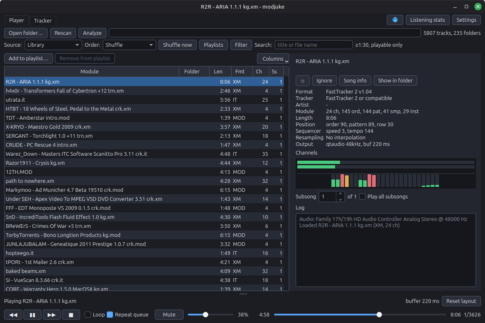

# modjuke



A tracker-music player built with **C++20**, [**Qt 6**](https://www.qt.io/) and [**libopenmpt**](https://lib.openmpt.org/libopenmpt/) for modern desktops.

A Windows 9x version is available [here](https://github.com/FlamingLeo/modjuke95).

## Features

- Folder scanning, search, and filters for format, duration, and playable files.
- Automatic background analysis of library modules for lengths, formats, channel counts, subsong counts, and titles.
- Playlists with automatic saving, drag-to-reorder, and M3U import/export.
- Favorites and ignore lists.
- A tracker view with centered playback following and optional smooth scrolling.
- Song information, sample/instrument names, and module comments.
- Track looping, queue repeat, persistent shuffle orders, and subsong selection.
- Configurable output sample rate, interpolation, buffering, and silent playback.
- Five built-in themes plus custom themes with a visual color editor.
- Optional session restoration and local listening history.
- Selectable queue columns with independently saved visibility preferences.

## Downloads

Ready-made packages for Linux, Windows and macOS are on the [releases page](https://github.com/FlamingLeo/modjuke/releases). They include Qt and libopenmpt, so nothing else needs to be installed.

| System | Package | First start |
| --- | --- | --- |
| Linux (x86-64, glibc 2.35+: Ubuntu 22.04, Debian 12, Mint 21 or newer) | `modjuke-VERSION-x86_64.AppImage` | `chmod +x` the file, then run it |
| Windows 10/11 (x64) | `modjuke-VERSION-windows-x64.zip` | Extract the folder and run `modjuke.exe`. SmartScreen may warn about an unknown publisher: **More info → Run anyway** |
| macOS 12+ (Apple silicon and Intel) | `modjuke-VERSION-macos.dmg` | Drag modjuke to Applications. The app isn't notarized: on first start, confirm in **System Settings → Privacy & Security → Open Anyway** |

Settings and data are shared with a source build (see [Local data](#local-data)). On Windows, `modjuke.exe --check` and `--scan` print to the console they were started from; cmd shows the output after its prompt, so redirect it for scripts (`modjuke.exe --check > check.txt`).

The packages are built by GitHub Actions (`.github/workflows/build.yml`) on every push to `master` and kept as artifacts of the run. A tag `v*` (for example `git tag v1.1 && git push origin v1.1`) also creates a draft release with the three packages attached, to be published on GitHub.

## Requirements

- A **C++20** compiler, **CMake 3.22+**, and a build system such as Ninja.
- **Qt 6.4+** development packages: Core, Gui, Widgets, Multimedia, and (on Linux) DBus.
- The **libopenmpt shared library**, installed separately. The player loads it at runtime. libopenmpt headers are not required.
- For audible playback, an available system audio output supported by Qt Multimedia.

## Installation (Linux, per-user)

Install the system dependencies first. For example:

```bash
sudo apt update
sudo apt install build-essential cmake ninja-build qt6-base-dev qt6-multimedia-dev libopenmpt0t64
```

> [!IMPORTANT]
> On older Debian/Ubuntu releases, use `libopenmpt0` if that is the available package. Other distributions use equivalent Qt and libopenmpt packages. Qt Multimedia uses the system audio service. a PulseAudio-compatible service is commonly provided by PulseAudio or PipeWire on Linux.

From the extracted repository directory:

```bash
cmake -S . -B build -G Ninja \
  -DCMAKE_BUILD_TYPE=Release \
  -DCMAKE_INSTALL_PREFIX="$HOME/.local"
cmake --build build --parallel 2
cmake --install build
```

Launch **modjuke** from the application menu, or run:

```bash
~/.local/bin/modjuke
~/.local/bin/modjuke --check
```

If `~/.local/bin` is on your `PATH`, the shorter `modjuke` command works too. Otherwise add this line to your shell profile and open a new terminal:

```bash
export PATH="$HOME/.local/bin:$PATH"
```

### Updates and removal

Close the player, extract the new source, and repeat the configure, build, and install commands with the same installation prefix. This replaces the installed executable and resources, not your settings or music. This CMake installation does not manage previous releases or automatic rollback.

Uninstall with the included script:

```bash
./uninstall.sh
```

It removes the paths recorded in `build/install_manifest.txt`. If that manifest is unavailable, it removes the standard `~/.local` installation. For another prefix, specify it explicitly:

```bash
./uninstall.sh --prefix /usr/local
```

For a system-wide installation, run the script with the privileges needed to remove those files (for example, `sudo ./uninstall.sh --prefix /usr/local`). Removal leaves your configuration, cached metadata, playlists, listening history, and music intact.

### Locations

| Item | Default per-user location |
| --- | --- |
| Executable | `~/.local/bin/modjuke` |
| Menu entry | `~/.local/share/applications/modjuke.desktop` |
| Icon | `~/.local/share/icons/hicolor/256x256/apps/modjuke.png` |
| Configuration and local data | `~/.config/modjuke/`, unless `XDG_CONFIG_HOME` is set |

After installation, the source directory can be moved or deleted. Qt and libopenmpt must remain installed on the system.

### Run without installing

After building, run directly from the repository:

```bash
./build/modjuke
./build/modjuke --check
```

If automatic libopenmpt detection fails, set its full shared-library path:

```bash
MODJUKE_LIBOPENMPT=/full/path/to/libopenmpt.so.0 ./build/modjuke
```

The override is a runtime environment variable, not a path recorded by the CMake installer. Set it in your launch environment if it is also needed for application-menu launches.

### Packages and other systems

The scripts in `packaging/` make the same packages as the releases. Each needs a Release build first. The Linux and macOS packages build libopenmpt from its official source release (`packaging/libopenmpt.sh`, no extra libraries needed); the Windows package uses the official libopenmpt DLLs. Output goes to `dist/`.

- **Linux AppImage:** `sh packaging/appimage.sh build`, with Qt's `qmake` on `PATH` (or `QMAKE=/path/to/qmake`). The AppImage runs on systems at least as new as the one it was built on.
- **Windows:** build with MSVC and Qt for MSVC (from the [Qt online installer](https://www.qt.io/download-qt-installer-oss) or [aqtinstall](https://github.com/miurahr/aqtinstall)) in a Visual Studio developer PowerShell, with Qt's `bin` folder on `PATH`, then run `pwsh packaging/windows.ps1 -BuildDir build`.
- **macOS:** with Qt for macOS, configure with `-DCMAKE_OSX_ARCHITECTURES="arm64;x86_64"` for both processor types, then run `sh packaging/macos.sh build`. Without packaging, `brew install libopenmpt` provides the library for `build/modjuke.app`.

On every system, modjuke looks for libopenmpt next to itself first (`../lib/libopenmpt.so.0` on Linux, `libopenmpt.dll` on Windows, `Contents/Frameworks/libopenmpt.0.dylib` on macOS), then in the system's library locations (on macOS also Homebrew's). `MODJUKE_LIBOPENMPT` takes precedence over all of them.

## Getting started

1. Open a folder with **Ctrl+O**, or use **Playlists** to add individual files.
2. Let automatic analysis fill in library module details. Playback can continue while it runs.
3. Double-click a queue entry, or select it and press **Enter**, to play.
4. Switch between **Player** and **Tracker** with the tabs or **Ctrl+T**.

Search narrows the displayed queue. The Filter dialog adds format, duration, and playable-only criteria. Use **Rescan** or **F5** to discover files added or changed outside the application.

### Queue source and order

Use **Source** to choose **Library** or a saved playlist, including Favorites. **Order** applies only to that source:

- **By directory** groups songs into folder branches in one queue.
- **Alphabetical** shows one list sorted by filename.
- **Shuffle** shuffles the selected library or playlist without changing its saved order.
- **Saved order** is available for playlists. Use it to view and edit their stored sequence.

Changing sources keeps the current order choice, except that switching to Library changes Saved order to By directory. **Playlists → Load** also selects a source without changing the order choice. Saving the current queue as a new playlist, or importing an M3U, opens it in Saved order.

**Shuffle now** (**Ctrl+S**) draws a new order for the current source, keeping the current song first when it belongs to that source. Search and filters narrow that plan without reshuffling it. New songs join the queue without rearranging existing ones. use Shuffle now to mix them in. **Repeat queue** draws a fresh shuffle each round and avoids immediately repeating the last song when another visible song is available. Ignoring the final queued song also starts a fresh round when both Shuffle and Repeat queue are enabled.

The selected source, order, and current shuffle survive restarting the app. Each library folder and playlist keeps its own shuffle order. Switching source or order and back brings the same sequence back. Changing source or order does not interrupt the current song and reveals it at the top of the visible queue if it is included. Opening or rescanning a folder updates Library without replacing a selected playlist source.

Use **Columns** to show or hide Folder, Length, Format, Channels, and Subsongs. Module always remains visible. The **Ch** and **Ss** headers show channel and subsong counts. **Ctrl+0** resets column widths and layout without changing your column visibility choices.

### Automatic analysis

**Settings → Analyze new files automatically** is on by default. Opening or rescanning the library starts background analysis of missing details, including library files hidden by search or filters. Matching cached metadata is reused. Analysis populates lengths, titles, formats, and channel/subsong counts without requiring playback.

Turn the setting off and save to prevent future automatic batches. An existing batch can be canceled using the analysis button. **Analyze** remains available for manual library analysis. after re-enabling automatic analysis, rescan to pick up missing details. **Keep duration/title details (analysis cache)** controls whether newly analyzed metadata is saved for later runs.

Automatic analysis covers the open library. playlist-only additions are not automatically analyzed. Analysis also does **not** watch the filesystem. Use Rescan to discover external changes. The headless `--scan` command has a separate explicit `--analyze` option.

### Playlists

Open **Playlists** with **Ctrl+P** to create, load, rename, or delete named lists. Add files directly, or select queue entries and use the playlist actions or context menu.

While a playlist is loaded:

- Choose **Order → Saved order**, then drag rows to reorder them or use **Ctrl+Up / Ctrl+Down** for a selected row.
- Import or export M3U files to exchange lists with other players.

### Favorites

- Click **☆** in the Player's song-info panel to add the loaded song to Favorites. **★** means it is saved. click again to remove it.
- Select queue songs, then **right-click → Add to Favorites**. Duplicate entries are skipped. Favorites is also available under **Add to playlist**.
- Choose **Source → Playlist: Favorites** to browse it. Use **Shuffle** to shuffle Favorites or **Saved order** to edit its sequence.
- Favorites cannot be renamed or deleted. **Clear Favorites** removes its entries after confirmation, but keeps the playlist and your music files.

Favorites is stored in `playlists.json`. An existing playlist named Favorites, case-insensitively, is reused with its contents and spelling preserved. Importing `Favorites.m3u` creates a separately named playlist instead of overwriting Favorites.

### Tracker and song information

The Tracker view displays the module's patterns. **Following** keeps the playback row centered. scrolling manually switches following off. Use **Follow** to resume. **Shift+wheel** scrolls across channels when they do not all fit.

**Smooth tracker scrolling** is off by default. enable it in Settings. Folder and source/queue toolbar rows are hidden in Tracker, while playback and queue state are retained. Open **Song info** with **Ctrl+I** for sample/instrument names and comments.

### Subsongs

Some files contain multiple songs or independent sequences recognized by libopenmpt. The Player's subsong selector is numbered starting at **1**. Choosing a subsong restarts it, preserves pause, and turns off **Play all subsongs**.

- A newly selected file starts at its first subsong.
- Session restoration can reopen the saved subsong and position, paused.
- **Play all subsongs** is off by default. Enabling it starts at the first subsong and plays the sequence before advancing to the next file, when auto-advance is enabled. Loop repeats the whole sequence in this mode.
- Time and seeking refer to the current subsong, not a combined timeline.
- The queue, Next, and Previous remain **file-based**. subsongs do not become separate queue entries.

Subsong detection depends on libopenmpt and can include alternate starting positions. A module that never ends naturally cannot advance automatically.

## Settings and audio

Use **Save** to apply and remember settings. **Cancel** discards pending preference and theme changes. The ignored-song manager performs its own changes immediately. those are not rolled back by canceling Settings.

| Setting | Default / behavior |
| --- | --- |
| Analyze new files automatically | On. background analysis when opening/rescanning the library |
| Keep duration/title details | On. save analyzed metadata for reuse |
| Remember the subsong and playing position | On. restore the last module paused |
| Record local listening stats | On. local play counts and playback time |
| Smooth tracker scrolling | Off. optional smooth playback following |
| Theme | Dark. applies on Save without restarting |
| Window title | Track name. module title, filename, and no track information are also available |
| UI refresh | 60 updates per second. adjustable from 5 to 120 |
| Audio backend | Default output through Qt Multimedia. silent fallback when unavailable |
| Sample rate | Device default. common fixed rates are also available |
| Interpolation | Sinc. off, linear, and cubic are also available |
| Buffer | 220 ms requested audio buffer |
| Don't ask again when ignoring songs | Off. uncheck to restore the confirmation |

The CLI backend names are **`auto`** and **`null`**. Changing audio settings can briefly restart output. Theme changes alone do not restart playback. The requested buffer size is not a guarantee of end-to-end device latency.

Device-latency and watchdog/restart-budget fields are not active Qt controls. This player does not implement an audio watchdog.

### Custom themes

In **Settings → Appearance → Theme**, select a starting palette and choose **New theme…**. The editor groups all **33 color roles** into:

- Surfaces
- Text and accents
- Status and meters
- Tracker
- Seek bar
- Tracker effects

Select a role in the list or click the sample preview. Use **Choose color…**, or enter a six-digit **`#RRGGBB`** value. The preview updates locally without recoloring the player or changing its audio. The preview also supports arrow-key role selection. A main-text contrast hint helps spot hard-to-read combinations without preventing intentional low-contrast themes.

**Reset color** restores the selected color to its value when the editor opened. **Reset all colors…** restores the entire starting palette after confirmation, keeping the name.

Give the theme a unique name of 1–60 characters, then press **Use theme** to return to Settings. Press **Save** in Settings to apply and persist it. Canceling the editor discards that edit. canceling Settings discards all staged theme creations, edits, and deletions.

Saved custom themes appear as **Name (custom)**. **Edit…** updates or renames the selected custom theme without changing its ID. **Delete** schedules its removal after confirmation and selects Dark. Built-in themes cannot be overwritten or deleted. use New theme to copy one. Up to **100 custom themes** can be stored. Built-in names and aliases, duplicate names ignoring case, control characters, and the `custom:` name prefix are not allowed.

The built-in themes are **Dark**, **Light**, **Midnight**, **High contrast**, and **Amber CRT**. A saved custom theme can also be selected by name:

```bash
modjuke --theme "My theme"
```

Custom definitions are stored under `custom_themes` in `config.json`, with a stable `custom:<id>` and all 33 roles. The JSON key **`colours`** is retained for backwards compatibility. the UI and documentation otherwise use American English.

## Keyboard and mouse controls

| Control | Action |
| --- | --- |
| Space | Play / pause |
| Enter in the queue | Play the selected track |
| Page Up / Page Down | Previous / next file. Previous restarts the current song when past 3 seconds, and at the start of the queue (wrapping to the end only with Repeat queue) |
| Left / Right | Seek backward / forward 5 seconds |
| Ctrl+Left / Ctrl+Right | Seek backward / forward 30 seconds |
| Up / Down in the queue | Move selection |
| L / R / M | Toggle track loop / queue repeat / mute |
| + / − | Increase / decrease volume |
| 0 | Set volume to zero |
| Wheel over the volume slider | Adjust volume |
| F1 | Open About |
| Ctrl+O | Open a folder |
| F5 | Rescan the current folder |
| Ctrl+F | Focus search |
| Escape in the main window | Clear search |
| Ctrl+Shift+F | Open Filter |
| Ctrl+S | Shuffle now |
| Ctrl+P | Open Playlists |
| Ctrl+Up / Ctrl+Down | Move a selected playlist row in Saved order |
| Ctrl+T | Switch Player / Tracker |
| Ctrl+I | Open Song info |
| Ctrl+H | Open Listening stats |
| Ctrl+R | Show the playing file in the file manager |
| Ctrl+0 | Reset queue widths/layout, retaining column visibility |

## Command-line examples

```bash
# Open a library, optionally starting playback
modjuke ~/Music/Modules
modjuke ~/Music/Modules --autoplay

# Choose a theme and output backend
modjuke --theme amber
modjuke --backend auto --volume 70

# Run without audible output
modjuke --backend null

# List a directory without opening the GUI
modjuke --scan ~/Music/Modules
modjuke --scan ~/Music/Modules --analyze --order

# Diagnostics
modjuke --check
modjuke --version
modjuke --help
```

For the headless scanner, **`--order` is a flag** that requests alphabetical sorting. it does not take `alphabetical` as an argument. Scanning prints a text listing, not JSON. `--scan`, `--check`, and `--version` do not need a display. GUI commands and `--help` initialize Qt Widgets.

Other options include `--dir PATH`, `--interpolation off|linear|cubic|sinc`, `--track FILE`, and `--speed N` (a tempo factor from 0.05 to 20). `--theme`, `--volume`, `--interpolation`, `--backend` and `--speed` apply to that session only. `--track FILE` requests that file at startup without replacing the selected library/playlist source. It takes precedence over autoplay and session restoration. Invalid values (an unknown theme, `--volume 70%`, a folder that doesn't exist) are reported and nothing starts. `--scan` without a folder lists the last library folder.

## Local data

The data directory is **`$XDG_CONFIG_HOME/modjuke`**, or **`~/.config/modjuke`** when the variable is not set, on every system: on Windows that's `%USERPROFILE%\.config\modjuke`, on macOS `/Users/NAME/.config/modjuke`.

| File | Contents |
| --- | --- |
| `config.json` | Shared preferences, custom themes, session information, and window state |
| `analysis.json` | Cached module metadata |
| `playlists.json` | Named playlists and file paths |
| `listening-stats.json` | Local listening history |
| `ignored.json` | Exact file paths hidden everywhere. playlist membership is retained for restoration |
| `shuffles.json` | Saved shuffle order for each library folder and playlist |
| `qt-ui.json` | Qt-only ignore confirmation, Play all subsongs, and hidden queue columns |

Back up this directory to retain preferences and history. The first six files contain shared preferences and data, including the custom-theme format. Qt-only preferences are kept separate. Run one application at a time against a shared data directory to avoid competing saves.

The app starts a fresh shuffle round when ignoring the final song with Repeat queue enabled.

For a separate Qt profile, set `XDG_CONFIG_HOME` to a different base directory before launching:

```bash
XDG_CONFIG_HOME="$HOME/.config/modjuke-profile" modjuke
```

## Troubleshooting

**The player runs, but there is no sound**  
Run `modjuke --check`, then inspect the output shown in the application. The check command validates libopenmpt and prints saved preferences. it is not a speaker check. The `null` backend is intentionally silent. Select Default output, check mute and volume, and verify the system output device and Qt Multimedia installation. Qt may fall back to silent output when no audio device is available.

**libopenmpt could not be found**  
Install the native shared library. If needed, set `MODJUKE_LIBOPENMPT` to its full path. libopenmpt development headers are not required. The packages include libopenmpt; `modjuke --check` shows which file was loaded.

**Qt reports a missing platform or multimedia plugin**  
Install the distribution's Qt platform/Multimedia runtime packages. Keep plugins and Qt libraries from the same installation. do not point `QT_PLUGIN_PATH` at a different Qt version. Use `QT_DEBUG_PLUGINS=1` for diagnostics. A desktop display session is required for the graphical player.

**Audio crackles or drops out**  
Increase Buffer, lower UI refresh, or temporarily disable automatic analysis. Check system audio configuration and load. Bluetooth and system buffering can add latency beyond the requested buffer size. Device-latency and backend switches do not configure Qt output.

**New files are not appearing**  
Use Rescan or F5. Automatic analysis processes discovered library files. it does not continuously monitor filesystem changes.

**A custom theme is hard to read**  
Restart with `modjuke --theme dark` or `--theme light` (for that session), then edit the custom palette in Settings. Unsaved preview changes affect only the editor. A color in `config.json` that isn't a valid `#RRGGBB` value (or the short `#RGB`) falls back to the dark theme's color for that role; the rest of the theme is kept.

**Settings cannot be saved**  
Check permissions and free space in the configuration directory. An unreadable or malformed `qt-ui.json` is renamed to `qt-ui.json.bad` and a fresh one is written (it only holds the column, play-all-subsongs and ignore-confirmation choices). A damaged `config.json` is kept as `config.json.bad`, and the player starts with defaults and says so. A damaged `playlists.json` is never overwritten, playlist changes aren't saved until it is fixed or moved aside. The Settings dialog keeps its drafts open for retry after a failed save.

**A module is unreadable or behaves unexpectedly**  
Check terminal diagnostics and try the file in another libopenmpt-based player. Format support and subsong detection depend on the installed library. Damaged files may not load, and the player cannot repair them.

The archive contains application source and resources only—not build outputs or historical verification captures.

